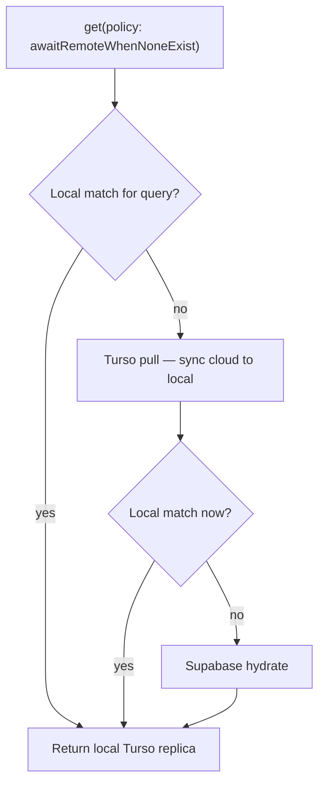
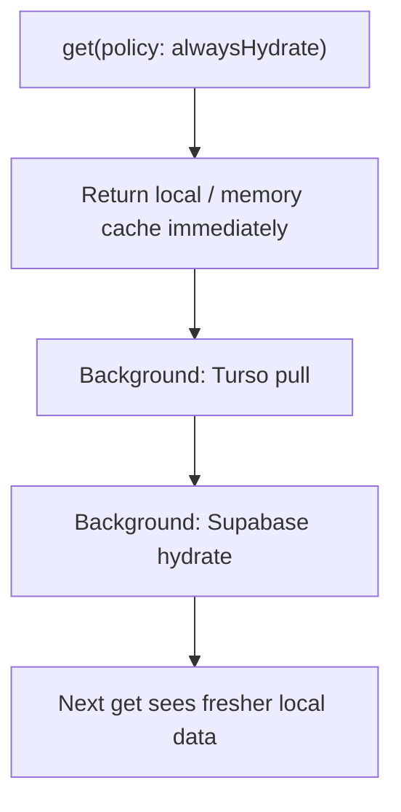

# Turso + OfflineFirst get policies

Flipper's main Brick database uses a **Turso embedded replica** (local file) synced with **Turso Cloud**. The Brick **remote provider** is still **Supabase** (PostgREST). `Repository.get()` must consider both when refreshing data.

Full Turso setup: [turso.md](./turso.md). Policy reference: [../offline_first/policies.md](../offline_first/policies.md).

## Data sources

| Layer | What it is | How it updates |
|-------|------------|----------------|
| Local replica | `flipper_v45.sqlite` via Turso | App writes, `pull()` from Turso Cloud |
| Turso Cloud | `libsql://…turso.io` | `turso db shell`, other replicas, `push()` |
| Supabase | `remoteProvider` | `hydrate()` on get, offline HTTP queue on upsert |

**Turso Cloud ≠ Supabase.** Rows inserted only in Turso Cloud are invisible locally until `pull()`. Rows only in Supabase require `hydrate()`.

## `awaitRemoteWhenNoneExist` (default)

Used when local may be empty (e.g. tax config for a new type).



- **Awaited:** Turso pull runs before returning if local was empty.
- **Then:** Supabase hydrate only if still empty.

## `alwaysHydrate`

Used when stale local data is acceptable on first paint but background refresh is desired.



- **Unawaited:** Caller gets current local rows right away.
- **Background:** Turso pull, then remote hydrate (same order as foreground refresh).

## Other policies

| Policy | Turso pull | Remote hydrate |
|--------|------------|----------------|
| `localOnly` | No | No |
| `awaitRemote` | No* | Yes, awaited |

\* `awaitRemote` still hydrates only from the remote provider; use `awaitRemoteWhenNoneExist` or `alwaysHydrate` for Turso cloud freshness.

## Seeding existing data to Turso Cloud

`push()` only uploads **incremental** changes after sync connects. To upload a full existing local file once:

1. Quit the app (release file lock).
2. `turso db create flipper --group default --from-file /path/to/flipper_v45.sqlite` (or `turso db import`).
3. Update `tursoDatabaseUrl` / token in `secrets.dart` if the DB name changed.

CLI database **name** may differ from hostname (e.g. name `flipper`, URL `flipper-richard457….turso.io`). Use `turso db list` / `turso db show flipper`.

## Flipper implementation

- Main DB factory: `PlatformHelpers.getMainDatabaseFactory()` in `supabase_models`.
- Queue DB stays **sqflite** (`brick_offline_queue_v45.sqlite`).
- Do not open the main replica with `sqlite3` while Flipper is running.

## Troubleshooting sync errors

### `401 Unauthorized` / role does not exist

The auth token no longer matches the Turso database (common after `turso db destroy` + `turso db create`).

```bash
turso db tokens create flipper
turso db show flipper --url
```

Update `tursoDatabaseAuthToken` (and URL if changed) in `secrets.dart`.

### WAL checkpoint failed on pull/push

The **local replica WAL** is out of sync with Turso Cloud (common after cloud re-import while keeping the old local file).

1. **Fully quit** Flipper.
2. **Back up** then **delete** the local main DB and sidecars, e.g.:

```bash
DB="$HOME/Library/Containers/rw.flipper/Data/Documents/flipper_v45.sqlite"
cp "$DB" "$HOME/Desktop/flipper_v45.backup.sqlite"
rm -f "$DB" "${DB}-wal" "${DB}-shm"
```

3. Also remove orphaned Turso sync sidecars (if the DB file is gone but sync still fails):

```bash
rm -f "${DB}-info" "${DB}-changes" "${DB}-wal" "${DB}-wal-revert" "${DB}-shm"
rm -f "$(dirname "$DB")/client_wal_index"   # legacy libsql name
```

4. Relaunch — `bootstrapIfEmpty` downloads a fresh replica from Turso Cloud.

Brick auto-removes orphaned `-info` / `-changes` sidecars when the main DB file is missing (see `TursoReplicaPaths`).

### Existing production devices (pre-Turso sqflite `flipper_v45.sqlite`)

Upgrades should **keep** the existing local file:

- `bootstrapIfEmpty` is **false** when the file exists and has data.
- First connect opens the legacy SQLite as a Turso embedded replica (no `-info` sidecar yet).
- `initialize()` **push** uploads local changes to Turso Cloud; **pull** merges cloud changes.

Do **not** delete customer DB files on upgrade. Only delete sync sidecars when intentionally resetting sync after a broken partial delete.

If Turso Cloud was seeded from another machine (`turso db create --from-file`), other devices may need a one-time local reset (backup → delete DB + `-info`/`-changes` sidecars → relaunch) to match cloud.

Brick logs a warning and continues offline if pull/push fails at startup; fix credentials or reset the local file to restore sync.
